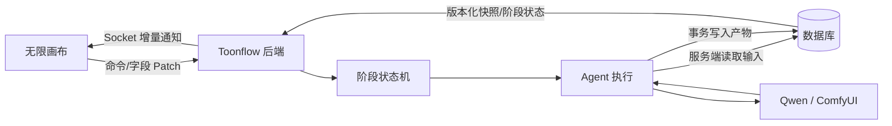

# Production Agent 状态链路与性能治理计划

> 状态：审核完成（附审核批注）  
> 日期：2026-09-26  
> 审核日期：2026-09-26  
> 范围：`Toonflow-app` 后端、`Toonflow-web` 生产画布前端  
> 原则：先保证产物可靠落盘，再减少无效推理，最后治理重连与画布刷新；不调整 GPU、SSH、隧道和模型量化配置。
>
> **审核总结：方案方向正确，能解决核心问题。存在三处严重遗漏需修正：(1) 未识别已有的 `AgentRunScheduler` 并发控制机制；(2) 未识别已有的 `afterRun`/`beforeRun` 产物校验钩子；(3) `get_flowData` 读取未经队列保护的并发风险未被提及。详见各节批注。**

## 1. 背景

当前“无限画布”问题同时涉及数据可靠性和推理性能，不能再分别通过提示词或局部空值判断修补。

已经确认的主要现象：

1. 分镜表、导演计划先进入浏览器内存，再由前端节流保存。断线、切集、并发任务或迟到请求可能造成数据丢失或旧快照覆盖新状态。
2. 分镜表保存在 `o_agentWorkData.data` JSON 中，分镜面板保存在 `o_storyboard` 等独立表中，两者没有统一事务和一致性约束。
3. Agent 的阶段推进主要由模型理解提示词决定，没有持久化的代码级状态机。
4. Socket 重连只能重新读取聊天历史和数据库快照，未完成的流式 XML 不是可恢复事务。
5. 前端深度监听整份 `flowData`，文本流、图片轮询和普通内容更新可能触发布局重新计算。
6. `/production/saveFlowData` 使用整份 JSON 覆盖写入，不同异步操作可能发生”后写入的旧快照覆盖先写入的新数据”。

> **[审核补充]** 以上现象描述准确，已通过代码验证。但遗漏了两个已有的防御机制：
>
> - **`AgentRunScheduler`**（`src/utils/agent/scheduler.ts`）：已实现全局 maxActive=2、maxQueued=4，且通过 `activeProjects` Set 保证同一 projectKey 同一时刻只有一个 Agent 运行。这意味着”相同项目并发运行”在调度层已被阻止。
> - **`afterRun` / `beforeRun` 钩子**（`src/agents/productionAgent/index.ts:372,389`）：阶段4的 `storyboardTableAgent` 已有 `afterRun: () => requireFlowData(“storyboardTable”, “分镜表”)`，监督 Agent 已有 `beforeRun` 对分镜表的前置检查。这些是现有的产物校验点，方案应在此基础上增强，而非从零实现。

本次现场日志还证明，状态问题会直接放大为性能问题：阶段产物没有成功写入时，后续监督 Agent 仍可能继续运行，形成大量无效推理。

## 2. 已确认的性能证据

2026-09-26 现场操作记录：

| 阶段 | 文本请求数 | 累计输入 Token | 累计输出 Token | 累计请求耗时 |
| --- | ---: | ---: | ---: | ---: |
| 阶段1 | 8 | 49,207 | 8,851 | 142.855 秒 |
| 阶段2 | 5 | 26,250 | 830 | 19.989 秒 |
| 阶段3 | 8 | 33,098 | 1,121 | 45.148 秒 |
| 阶段4 | 11 | 89,882 | 11,549 | 173.887 秒 |

阶段4中的单次监督请求：

- 网关记录：`8072 prompt tokens + 8192 completion tokens`，耗时 `95.601 秒`。
- Qwen记录：预填充约 `0.995 秒`，解码约 `90.052 秒`，速度约 `90.96 token/s`。
- 请求刚好达到监督 Agent 的 `8192` 输出上限。
- 同期没有网关错误、隧道错误或模型服务异常。

由此确认：

- 核心瓶颈不是 SSH、HK 隧道或 4090 推理速度。
- 核心瓶颈是一次业务操作被拆成多轮串行推理，以及控制类 Agent 输出没有合理上限。
- 增加 Qwen 并发槽位不能加速存在前后依赖的工具调用链。

图片链路的同期记录：

- 9 张图片总墙钟时间约 `91.037 秒`。
- 单张 ComfyUI GPU 执行约 `7.615–10.574 秒`。
- GPU 计算合计约 `87.997 秒`，任务间空隙合计约 `3 秒`。

由此确认：单 GPU 图片任务的主要耗时是模型执行，盲目提高网关并发只会增加 ComfyUI 队列长度。

## 3. 本次治理目标

### 3.1 正确性目标

1. 后端是 Agent 产物和阶段状态的唯一可信数据源。
2. 分镜表未成功持久化时，阶段4不能完成，监督层和后续阶段不能启动。
3. 相同项目、集和阶段不能并发运行多个实例。**[审核：同项目互斥已由 `AgentRunScheduler` 实现；此目标的增量价值在于"同阶段"粒度的互斥和持久化状态，建议明确区分已有能力和新增能力。]**
4. 迟到请求或旧页面不能覆盖更新后的数据。
5. 重连后可以恢复阶段状态、持久化产物和媒体任务进度。
6. 分镜表、分镜面板、图片任务数量可以自动校验。

### 3.2 性能目标

1. 阶段4文本请求从现场的 11 次降至最多 3 次：决策、执行、可选监督。
2. 分镜表和监督 Agent 不再通过多轮模型工具调用读取本地数据。
3. 控制类 Agent 不再出现无业务价值的 8192-token 输出。
4. 阶段4在相同输入规模下，目标墙钟时间从约 180 秒降至 30–60 秒。
5. 普通文本流和图片状态更新不触发全画布重新布局。

### 3.3 非目标

本计划不包含：

- 更换 GPU、模型、量化等级或 SSH 密钥。
- 拆分模型到多台 GPU。
- 未经单独验证的 ComfyUI 批处理、采样步数或画质调整。
- 全面重写现有工作流数据模型。

## 4. 目标数据链路



关键约束：

- Socket 是通知通道，不是持久化通道。
- XML 可以保留为模型输出格式，但必须由后端解析、验证和写入。
- 前端收到结果后只更新展示状态，不再代替 Agent 保存业务产物。

## 5. 分阶段实施计划

## Phase A：修复阶段4落盘和无效推理

### A1. 建立统一的后端 FlowData 服务

计划新增：

- `src/services/productionFlowData.ts`

职责：

- 按 `projectId + episodesId` 读取工作区数据。
- 对 Agent 暴露去除图片 URL、提示词等无关字段后的精简快照。
- 按字段更新 `scriptPlan`、`storyboardTable` 等内容。
- 在事务内完成读取、版本检查和写入。
- 集中处理 JSON 解析和空数据校验。

计划修改：

- `src/routes/production/getFlowData.ts`
- `src/routes/production/saveFlowData.ts`
- `src/agents/productionAgent/index.ts`
- `src/agents/productionAgent/tools.ts`

HTTP 路由和 Agent 不再各自实现一套读写逻辑，统一调用该服务。

### A2. 分镜表由后端直接写入

> **[审核]** 方向正确。需注意：现有代码已有 `afterRun: () => requireFlowData("storyboardTable", "分镜表")` 作为阶段4完成后的校验钩子，以及监督 Agent 的 `beforeRun` 前置检查（仅当 prompt 包含"分镜表"或"阶段4"时触发）。本节方案应定位为**增强**这些钩子——将校验从"事后检查"提升为"事务性写入"，而非重新实现。
>
> **[严重问题]** `get_flowData` 工具（`tools.ts:90`）的读取操作不经过 `socketQueue`，而分镜表写入经过 `socketQueue(800ms)` 节流。这意味着一个 Agent 步骤刚写入分镜表（排队中），下一个步骤的 `get_flowData` 可能读到旧值。方案 A2 的"后端一次性读取"能解决 Agent 侧的读写不一致，但前端的 `get_flowData` 调用仍需处理。建议：Phase A 中同时将 `get_flowData` 标记为 Agent 不可用工具（配合 A3 的工具白名单）。

阶段4执行流程改为：

1. 后端一次性读取 `script`、`scriptPlan`、`assets` 和模型信息。
2. 将这些数据直接注入分镜表 Agent 的初始上下文。
3. 分镜表 Agent只执行一次正文生成，不允许再调用 `get_flowData` 或无关工具。
4. 后端从最终响应提取 `<storyboardTable>...</storyboardTable>`。
5. 校验标签完整、正文非空、基本 Markdown 结构存在。
6. 在数据库事务中写入 `storyboardTable`。
7. 回读并确认写入值一致。
8. 写入成功后才允许启动监督层。（**[审核]** 替换现有 `afterRun` 钩子中的 `requireFlowData` 检查，改为事务写入确认。）

异常规则：

- 没有完整标签：阶段失败。
- 标签内容为空：阶段失败。
- 数据库版本冲突：阶段失败并要求基于新版本重试。
- 客户端断线：不影响已经进入后端事务的落盘。

### A3. 减少模型工具往返

计划修改 `src/agents/productionAgent/index.ts`：

- 分镜表 Agent不再通过模型调用依次读取剧本、计划和资产。
- 监督 Agent由后端一次性提供分镜表、剧本和资产。
- 子 Agent只获得当前任务需要的工具白名单。
- 分镜表 Agent不能调用资产生成、删除、分镜面板写入等工具。
- 监督 Agent保持只读。

### A4. 控制类 Agent 输出预算

计划修改 `src/utils/ai.ts`：

| Agent | 当前上限 | think | 第一版建议上限 |
| --- | ---: | :---: | ---: |
| `productionAgent:decisionAgent` | 12288 | ✅ level=2 | 2048 |
| `productionAgent:supervisionAgent` | 8192 | ✅ level=1 | 2048 |
| `productionAgent:directorPlanAgent` | 12288 | ✅ level=2 | 4096 |
| `productionAgent:storyboardTableAgent` | 8192 | ❌ | 暂不降低 |
| `productionAgent:storyboardPanelAgent` | 8192 | ❌ | 暂不降低 |
| `productionAgent:deriveAssetsAgent` | 8192 | ❌ | 暂不降低 |
| `productionAgent:generateAssetsAgent` | 8192 | ❌ | 暂不降低 |

> **[审核修正]** 原表"长正文执行 Agent 8192/16384"不准确。代码中所有执行类 Agent 均为 8192（`src/utils/ai.ts:58-62`），16384 仅存在于 `scriptAgent:scriptAgent`（剧本模块，不属于 production 链路）。已补全完整 Agent 列表和 think 模式状态。
>
> **[建议]** `decisionAgent` 和 `supervisionAgent` 均开启了思考模式，思考 token 不计入 `maxOutputTokens`。降至 2048 后，思考模式的 token 开销仍然存在。建议第一版同时将 `supervisionAgent` 的 `thinkLevel` 从 1 降至 0，因为监督报告是结构化输出，不需要链式推理。

附加规则：

- 控制类 Agent 出现 `finish_reason=length` 时不能标记业务成功。
- 监督报告继续遵循现有精简格式。
- ~~是否关闭监督层思考模式，放到后续一次小规模 A/B 验证决定；第一版先降低输出上限，避免同时改变过多变量。~~ **[审核修改]** 建议第一版直接关闭 `supervisionAgent` 的思考模式（`thinkLevel: 0`）。理由：监督报告是结构化格式检查，不需要推理链；思考 token 不受 `maxOutputTokens` 限制，不降级思考模式则降低输出上限的效果会被思考 token 开销抵消。

> **[审核补充]** 当前各 Agent 的 maxSteps 配置（`src/utils/ai.ts:10-22`）同样影响性能：`decisionAgent=12, supervisionAgent=8`。每个 step 都是一次完整的模型请求。建议 Phase A 同时将 `supervisionAgent` 的 maxSteps 从 8 降至 3（监督只需读取+评估+输出），`decisionAgent` 从 12 降至 6。

### Phase A 验收标准

- 浏览器断开时，阶段4仍能写入分镜表。
- 分镜表为空时，监督 Agent不会启动。
- 阶段4最多产生 3 次文本请求。
- 不再出现监督 Agent输出8192 token。
- 刷新页面后分镜表仍存在。
- 不发送真实图片或视频请求完成自动化验证。

## Phase B：阶段状态机和版本化字段更新

### B1. 持久化阶段状态

> **[审核]** 新增独立状态表的方向正确，但需明确与现有 `AgentRunScheduler` 的关系：
>
> - **已有能力**：`AgentRunScheduler` 已保证同一 projectKey 同一时刻只有一个 Agent 运行（内存级互斥）。
> - **本表新增价值**：(1) 持久化——服务重启后可恢复阶段状态；(2) 阶段粒度——区分"同项目不同阶段"的状态；(3) 前置条件——代码级保证阶段顺序依赖。
> - **建议简化**：`runId` 和 `artifactSummary` 可推迟到 Phase C 再加，Phase B 先只建核心字段（projectId, episodesId, stage, status, revision, error），降低实施复杂度。

建议新增表 `o_agentStageState`，避免把运行状态继续混入大 JSON：

| 字段 | 含义 |
| --- | --- |
| `projectId` | 项目 ID |
| `episodesId` | 集 ID |
| `stage` | 1–6 |
| `status` | `pending/running/completed/failed` |
| `runId` | 本次运行唯一 ID |
| `revision` | 乐观锁版本号 |
| `startedAt` | 开始时间 |
| `finishedAt` | 结束时间 |
| `error` | 失败原因 |
| `artifactSummary` | 产物数量、摘要或校验结果 |

唯一约束：`projectId + episodesId + stage`。

计划修改：

- `src/lib/initDB.ts`
- `src/lib/fixDB.ts`
- `src/socket/routes/productionAgent.ts`
- `src/agents/productionAgent/index.ts`

状态转换规则：

```text
pending -> running -> completed
                   -> failed
failed  -> running（用户明确重试）
```

禁止行为：

- 前置阶段未完成时启动后续阶段。
- 同阶段已有 `running` 任务时再次启动。**[审核：需与 `AgentRunScheduler` 协调——调度器已在内存中阻止同项目并发，此处的数据库级检查作为二级防线，需处理调度器和数据库状态不一致的边界情况（如服务重启后 status 卡在 running）。建议：服务启动时将所有 `running` 状态重置为 `failed`，附 error="服务重启中断"。]**
- 产物为空或一致性校验失败时标记 `completed`。
- 模型仅在文本中宣称完成，但数据库状态和产物没有变化。

### B2. 字段级 Patch 与乐观锁

> **[审核]** 这是解决 `saveFlowData.ts` 全量覆盖问题的正确方案。当前 `saveFlowData` 的实现（第 46-62 行）完全没有版本检查，直接 `JSON.stringify(data)` 覆盖写入。字段级 Patch + 乐观锁能根治"后写旧快照覆盖新数据"的问题。
>
> **[优化建议]** `expectedRevision` 检查可以用数据库的 `UPDATE ... WHERE revision = ?` 实现（影响行数为 0 即冲突），无需额外的 SELECT-then-UPDATE，减少一次数据库往返。

保留现有读取接口，新增或改造字段级写入接口：

```text
patchFlowData(projectId, episodesId, field, value, expectedRevision)
```

第一批允许更新的字段：

- `scriptPlan`
- `storyboardTable`
- `workbench`
- 明确允许的用户编辑字段

规则：

- 每次成功写入递增 `revision`。
- `expectedRevision` 不匹配时返回冲突，不覆盖数据。
- Agent写入和用户编辑走同一版本检查。
- 暂时保留整份保存接口用于兼容，但禁止 Agent 使用；前端迁移完成后删除或限制该接口。

计划修改：

- `src/routes/production/saveFlowData.ts`
- 新增字段 Patch 路由
- `Toonflow-web/src/stores/productionAgent.ts`

### Phase B 验收标准

- 同一阶段并发启动只有一个能够进入 `running`。
- 前置阶段未完成时后续阶段返回明确错误。
- 旧 revision 保存返回冲突，不能覆盖新数据。
- 两个异步任务更新不同字段时互不覆盖。
- 服务重启后阶段状态仍可恢复。

## Phase C：重连恢复、画布解耦和一致性校验

### C1. 重连恢复

计划修改：

- `src/socket/routes/productionAgent.ts`
- `Toonflow-web/src/stores/productionAgent.ts`
- 必要时调整前端 Socket 封装

重连流程：

1. 获取数据库中的最新 FlowData revision。
2. 获取六个阶段的持久化状态。
3. 获取图片和视频任务的实际进度。
4. 用后端快照替换本地旧状态。
5. 再开始接收 Socket 增量通知。

不再尝试恢复未完成的 XML 字符流；只恢复已提交的业务产物和任务状态。

### C2. 解耦画布布局和内容状态

计划修改：

- `Toonflow-web/src/views/production/index.vue`
- `Toonflow-web/src/stores/productionAgent.ts`
- 相关 Flow Builder 或节点组件

拆分监听来源：

- 布局监听：只关心节点增删、边关系和用户位置调整。
- 内容监听：文本、阶段状态、图片状态只更新节点内容。
- 媒体轮询：只 Patch 目标资源，不替换整份 `flowData`。

### C3. 一致性校验

阶段完成前检查：

- 分镜表中的片段数和镜头数。
- 分镜面板实际条目数。
- `shouldGenerateImage=true` 的条目数。
- 图片任务的排队、执行、成功和失败数量。
- 分镜引用的资产 ID 是否存在。
- 分镜表和面板是否属于当前 project/episode/revision。

校验失败时：

- 阶段保持 `failed` 或 `running`，不能宣称完成。
- 返回结构化差异，例如“表格 12 镜，面板 10 条，缺少第 7、11 镜”。

### Phase C 验收标准

- Socket 断开重连后，分镜表、阶段状态和媒体进度一致。
- 图片轮询和文本流式输出不改变节点位置。
- 切集后迟到事件不能写入当前集。
- 数量不一致时不能进入图片生成阶段。

## 6. 观测日志

日志只记录能够直接定位性能和状态问题的边界，不做泛化链路追踪。

每个 Agent 阶段记录：

- `runId`
- `projectId`
- `episodesId`
- `stage`
- `agentType`
- `stepIndex`
- `toolName`
- `inputTokens`
- `outputTokens`
- `finishReason`
- `durationMs`
- `artifactRevision`

网关后续可补充：

- `startedAt`
- `queueMs`
- `upstreamMs`
- `timeToFirstTokenMs`
- `finishReason`

验收时应能回答：

1. 一次用户操作触发了几次模型请求。
2. 时间消耗在排队、预填充还是解码。
3. 哪一步生成了过多 token。
4. 产物写入了哪个 revision。
5. 为什么阶段被判定为完成或失败。

## 7. 测试计划

### 7.1 后端单元测试

- FlowData字段 Patch 成功并递增 revision。
- 旧 revision 写入被拒绝。
- XML标签缺失、未闭合和空内容被拒绝。
- 分镜表写入后回读一致。
- 阶段状态前置条件和并发锁正确。
- 产物为空时不能完成阶段。
- 工具白名单不包含无关写入或生成工具。
- 各 Agent 输出 token 上限正确。

### 7.2 Socket 与路由测试

- 断开客户端后，已经开始的服务端写入仍然完成。
- 重连返回最新 revision 和阶段状态。
- 切换 episode 后旧事件被忽略。
- 同阶段重复请求返回“正在运行”，不重复执行。

### 7.3 前端测试

- 字段 Patch 不替换其他字段。
- revision 冲突时重新拉取后端快照。
- 内容更新不触发布局函数。
- 重连先恢复快照，再消费增量事件。

### 7.4 验证命令

实施时根据现有脚本补齐具体命令，最低包括：

```bash
# Toonflow-app
yarn lint

# Toonflow-web
yarn type-check
yarn build-only
```

自动化测试使用固定模型响应或 fixture，不调用真实 GPU。全部自动化通过后，仅执行一次真实阶段4冒烟测试。

## 8. 提交与回滚边界

建议拆成三个独立提交：

1. `fix(agent): persist storyboard table on the server`
2. `fix(agent): add stage state and versioned field updates`
3. `fix(canvas): restore persisted state and decouple layout updates`

每个提交都应可以独立回滚。数据库变更使用向前兼容方式：新增表或字段，不直接删除旧数据；整份保存接口在前端迁移完成前保留兼容。

当前工作区已有未提交修改：

- `data/serve/app.js`
- `scripts/socketE2E.ts`
- `src/agents/productionAgent/index.ts`

实施过程中必须保留这些修改，并在其基础上做最小增量，不覆盖、不暂存、不回退用户现有工作。

## 9. 建议审核决策

请重点确认以下三项：

1. 是否接受新增 `o_agentStageState` 表，而不是继续把阶段状态放进 `o_agentWorkData.data` JSON。
2. 是否接受第一版将决策/监督/导演规划输出上限分别调整为 `2048/2048/4096`。
3. 是否按 Phase A、B、C 分三个提交实施，并在 Phase A 完成后先做一次阶段4验收，再继续后续阶段。

## 10. 推荐执行顺序

审核通过后建议按以下顺序实施：

1. Phase A：后端落盘、工具白名单、输出预算。
2. 完成静态测试，并进行一次阶段4真实冒烟测试。
3. Phase B：状态机、revision 和字段级 Patch。
4. Phase C：重连恢复、画布监听解耦、一致性校验。
5. 对比治理前后的请求数量、token 和阶段耗时，形成最终验收记录。

---

## 11. 审核结论

### 审核通过项

| 项 | 评价 |
| --- | --- |
| 问题诊断 | ✅ 准确。全量 JSON 覆盖、无版本控制、无持久化状态机、前端深度监听均已通过代码验证 |
| 性能证据 | ✅ 数据完整，结论正确：瓶颈在多轮串行推理和控制类 Agent 输出过大 |
| Phase A 落盘方案 | ✅ 方向正确，后端事务写入是解决断线丢数据的最优方案 |
| Phase B 乐观锁 | ✅ 正确解决 `saveFlowData` 全量覆盖问题 |
| Phase C 画布解耦 | ✅ 合理，布局与内容分离是标准实践 |
| 分阶段实施 | ✅ Phase A→B→C 的优先级排序合理 |

### 需修正的严重遗漏

| # | 问题 | 影响 | 建议 |
| --- | --- | --- | --- |
| 1 | 未识别已有 `AgentRunScheduler`（maxActive=2，同项目互斥） | Phase B 的并发控制设计可能与调度器冲突或重复实现 | B1 需明确与调度器的协作方式：调度器为内存级一级防线，数据库状态为持久化二级防线 |
| 2 | 未识别已有 `afterRun`/`beforeRun` 产物校验钩子 | A2 方案看似从零实现，实际应定位为增强现有钩子 | A2 实施时基于现有钩子改造，而非另建一套 |
| 3 | `get_flowData` 不经 `socketQueue` 保护 | Agent 步骤间的读写不一致风险未被覆盖 | Phase A 中将 `get_flowData` 从分镜表/监督 Agent 的工具白名单中移除 |

### 建议优化

| # | 优化项 | 理由 |
| --- | --- | --- |
| 1 | 第一版直接关闭 `supervisionAgent` 思考模式（`thinkLevel: 0`） | 监督报告是结构化格式检查，思考 token 不受 maxOutputTokens 限制，不关闭则降低输出上限的效果被抵消 |
| 2 | 降低 `maxSteps`：`supervisionAgent` 8→3，`decisionAgent` 12→6 | 每个 step 是一次完整模型请求，是请求次数膨胀的直接原因 |
| 3 | Phase B `o_agentStageState` 表先只建核心字段 | `runId`、`artifactSummary` 推迟到 Phase C，降低 Phase B 复杂度 |
| 4 | 乐观锁用 `UPDATE WHERE revision=?` 代替 SELECT-then-UPDATE | 减少一次数据库往返 |
| 5 | 服务重启时将所有 `running` 状态重置为 `failed` | 防止调度器和数据库状态不一致导致阶段死锁 |
